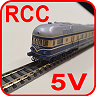

<table><tr><td></img></td><td>
Letzte &Auml;nderung: 5.4.2026     
<h1>3D-Druck-Teile für N-Spur-Module</h1><h3></h3>
<a href="#TableOfContents">==> Inhaltsverzeichnis</a>&nbsp; &nbsp; &nbsp;  &nbsp; 
<a href="README.md">==> English version</a>
</td></tr></table>   

   

# 1. Worum geht es?
Im Repository [`khartinger/RCC5V`](https://github.com/khartinger/RCC5V/blob/main/LIESMICH.md) werden Steuerelemente für Weichen, Gleise usw. vorgestellt, die zum Beispiel in N-Spur-Modelleisenbahn-Modulen eingesetzt werden. Für den Bau solcher Module wird oft Pappelsperrholz verwendet, es ist aber auch möglich, Teile mit dem 3D-Drucker herzustellen.   
Eine Beschreibung für den Holzrahmenbau findet sich zB in [https://github.com/khartinger/RCC5V/blob/main/examples/module12/LIESMICH.md](https://github.com/khartinger/RCC5V/blob/main/examples/module12/LIESMICH.md#20)   
Dieses Repository beschäftigt sich mit dem Entwurf und Druck von Modulrahmenteilen sowie Teilen für den Gleisunterbau. Als Software wird das kostenlose, quelloffene (Open-Source) [ 3D-CAD-Programm Freecad](https://www.freecad.org/), als 3D-Drucker wird ein [Prusa-XL-Drucker](https://www.prusa3d.com/de/produkt/original-prusa-xl-3d-drucker/) verwendet. Der Drucker hat ein maximales Druckvolumen von 360 x 360 x 360 mm³.   

   

## Inhaltsverzeichnis
1. [Worum geht es?](#x10)   
2. [Rahmenteile (Baseboard Frame)](#x20)   
3. [Blockpanel](#x30)   
4. [Schotterbett (Track Ballast)](#x40)   
5. [Bahndamm (Embankment)](#x50)   
6. [Werkzeuge (Tools)](#x60)    

   

# 2. Rahmenteile
Die hier vorgestellten Rahmenteile für N-Module haben eine Breite von 25 cm und Längen von 25 bis 100 cm. Da der Drucker maximal 36 cm lange Teile drucken kann, werden die Längsrahmenteile in 25 cm große Abschnitte unterteilt.   
Das folgende Bild gibt eine Übersicht über die Hauptarten von Rahmenteilen.   
   
_Bild 1: Übersicht über die Lage der Rahmenteile_   

Zusätzlich zu den Hauptarten von Rahmenteilen gibt es verschiedene Unterarten.   
#### Seitenteile ("West", "Ost")
* Eingleisiger Seitenteil mit Gleis in der Mitte des Rahmenteils   
* Zweigleisiger Seitenteil mit zwei Gleisen in der Mitte des Rahmenteils   

#### Frontrahmen ("Süd")
* Frontrahmen West   
* Frontrahmen Süd (Mitte)   
* Frontrahmen Ost   

Zusätzlich enthalten die Frontrahmen meist noch Aussparungen für die Steuerblöcke und/oder den OLED-Block (Steuerblock). Somit gibt sich für die Benennung der Frontrahmen folgende Syntax:   

#### Rückseitiger Rahmen ("Nord")
* Der rückseitige (nördliche) Rahmen wird oft aus Pappelsperrholz gefertigt, da er einfach zu fertigen ist 

#### Querstreben

#### Rahmen-Distanzplättchen

Technische Details und Freecad-Dateien zu Rahmenteilen finden sich im Unterverzeichnis [https://github.com/khartinger/RCC5V_3d-printable-parts-for-n-scale-modules/blob/main/fab/pp2_baseboard_frame/LIESMICH.md](https://github.com/khartinger/RCC5V_3d-printable-parts-for-n-scale-modules/blob/main/fab/pp2_baseboard_frame/LIESMICH.md).   

   
   
   
   

[Zum Seitenanfang](#up)