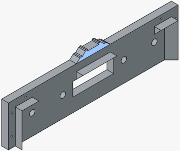
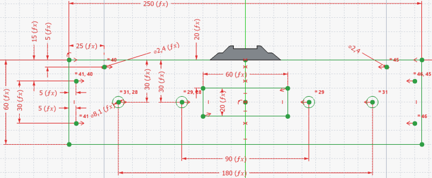

<table><tr><td></img></td><td>
Letzte &Auml;nderung: 6.4.2026     
<h1>Rahmenteile</h1><h3>3D-Druck-Teile für N-Spur-Module</h3>
<a href="#TableOfContents">==> Inhaltsverzeichnis</a>&nbsp; &nbsp; &nbsp;  &nbsp; 
<a href="README.md">==> English version</a>
</td></tr></table>   

   

# 1. Worum geht es?
In diesem Verzeichnis befinden sich die Freecad-Zeichnungen der Rahmenteile. Weiters werden Details zu den Rahmenteilen vorgestellt.   

   

## Inhaltsverzeichnis
1. [Worum geht es?](#x10)   
2. [Seitliche Rahmenteile](#x20)   

[Zum Seitenanfang](#up)   
   

# 2. Seitliche Rahmenteile
Seitliche Rahmenteile bestehen aus dem Basisteil und dem Aufsatz für das Gleis, wie das folgende Bild zeigt:   
   
_Bild 1: Seitlicher Rahmenteil mit einem Gleis in der Mitte_   

_Anmerkung_: Der Gleisaufbau ist blau markiert.   

Das folgende Bild zeigt die Maße des seitlichen Rahmenteils:   
   
_Bild 2: Maße des seitlichen Rahmenteils mit einem Gleis in der Mitte_   

   
   
   
   

[Zum Seitenanfang](#up)